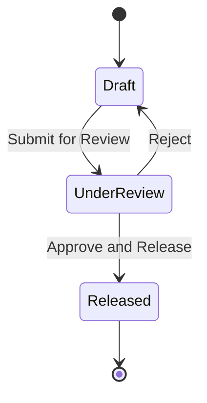

# Mini PDM Project Specification

## 1. Business Background

A manufacturing company wants to use Frappe to build a lightweight PDM (Product Data Management) system. The system will manage items, BOMs (Bills of Materials), and ECOs (Engineering Change Orders).

The goal is not to replace a full PLM system. The goal is to use a small but realistic project to learn Frappe modeling, permissions, workflow, cross-document business logic, reports, REST API, tests, and deployable configuration.

## 1.1 From Spreadsheet Business to System Objects

Many manufacturing teams start by using spreadsheets:

- One spreadsheet stores all items.
- One spreadsheet stores product structures or BOMs.
- One spreadsheet records engineering changes.

This works for a while, but problems appear quickly:

- Different people maintain different versions.
- A BOM may be changed before approval.
- Old and new versions become hard to trace.
- Production, purchasing, and quality teams may see different data.

This course turns those spreadsheet-like business objects into Frappe DocTypes, then adds permissions, workflow, validation, reports, and APIs.

## 1.2 User Stories

- As an engineering user, I want to maintain items and draft BOMs so that product structures are recorded.
- As an engineering manager, I want only reviewed BOMs to be released so that engineering data quality is controlled.
- As a quality user, I want to view only approved BOMs and released ECOs so that I avoid unconfirmed data.
- As an external system, I want to read item data through an API so that MES, WMS, or purchasing systems can integrate with Frappe.

## 2. Roles

- **Engineering User:** maintains items and draft BOMs, creates ECOs.
- **Engineering Manager:** reviews BOMs, submits ECOs, releases engineering changes.
- **Quality User:** views approved BOMs and released ECOs, but does not submit changes.
- **System Manager:** manages roles, permissions, fields, workflows, and system configuration.

## 3. Business Rules

- One BOM belongs to one finished item.
- A BOM must not contain the same child item twice.
- BOM child quantity must be greater than 0.
- Approved BOMs must not be directly modified by normal engineering users.
- Released ECOs must not be edited.
- When an ECO is released, the linked BOM version is updated to the ECO target version.
- Backend code that bypasses standard UI paths must explicitly consider permission and audit requirements.

## 4. Data Dictionary

### P-Item

| Field | Type | Required | Description |
| --- | --- | --- | --- |
| item_code | Data | Yes | Item code, should be unique |
| item_name | Data | Yes | Item name |
| specification | Small Text | No | Specification or model |

### P-BOM

| Field | Type | Required | Description |
| --- | --- | --- | --- |
| bom_code | Data | Yes | BOM code |
| item | Link / P-Item | Yes | Finished item |
| version | Data | Yes | Current version, such as A.0 or A.1 |
| status | Select | Yes | Draft, Approved |
| total_qty | Float | No | Total quantity calculated from child rows |
| items | Table / P-BOM Item | Yes | BOM child rows |

### P-BOM Item

| Field | Type | Required | Description |
| --- | --- | --- | --- |
| item | Link / P-Item | Yes | Child item |
| qty | Float | Yes | Quantity, must be greater than 0 |
| specification | Small Text | No | Specification fetched from item master data |

### P-ECO

| Field | Type | Required | Description |
| --- | --- | --- | --- |
| eco_code | Data | Yes | ECO code |
| bom | Link / P-BOM | Yes | BOM being changed |
| reason | Small Text | Yes | Reason for change |
| target_version | Data | Yes | BOM version after release |
| effective_date | Date | Yes | Effective date |
| approval_status | Select | Yes | Draft, Under Review, Released |

## 5. Permission Matrix

| DocType | Engineering User | Engineering Manager | Quality User |
| --- | --- | --- | --- |
| P-Item | Read, Write | Read, Write, Submit | Read |
| P-BOM | Read, Write | Read, Write, Submit, Cancel | Read |
| P-ECO | Read, Write | Read, Write, Submit, Cancel | Read |

## 6. ECO Workflow

## 7. Final Acceptance Scope

- Users can create items, BOMs, and ECOs.
- BOM validation prevents duplicate child items and non-positive quantities.
- Permissions distinguish engineering users, engineering managers, and quality users.
- Releasing an ECO automatically updates the linked BOM version and status.
- A report can query approved BOM structures and support filters.
- REST API can read and create item records through token authentication.
- Key configuration can be exported from the Custom App through fixtures.
