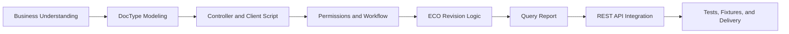

# Frappe ERP Development Tutorial: A Beginner-Friendly PDM Training Course

> Repository home: [../../README.md](../../README.md)
>
> License: documentation is CC BY-SA 4.0; code snippets in `CODE_SNIPPETS.md` are MIT licensed.

This course teaches Frappe Framework through a small but realistic PDM (Product Data Management) system. It is designed for learners who may not yet be strong in ERP, web frameworks, database design, or enterprise architecture.

Instead of starting from abstract framework concepts, the course starts from business objects: items, BOMs, engineering change orders, approvals, reports, and APIs. You will gradually learn how to turn real business rules into Frappe DocTypes, workflows, scripts, reports, tests, and deployable configuration.

The course is designed for junior developers, ERP implementation consultants, business analysts, and teams that need a gradual, concrete path into Frappe.

## Course Files

All course files live in the same folder. Links use `./file.md` relative paths so they work well on GitHub, GitLab, Gitea, VS Code, Obsidian, and similar tools.

1. **[Beginner Guide: Terms and Learning Path](./BEGINNER_GUIDE.md)**
   - Explains the most important Frappe and ERP terms.
   - Clarifies common confusions such as DocType vs Document and Link vs Table.
   - Gives one small example that continues through the whole course.

2. **[Lecture Notes: Concepts and Architecture](./LECTURE_NOTES.md)**
   - Explains DocType, metadata-driven development, permissions, workflow, reports, API, Bench, and deployment.
   - Uses concrete ERP/PDM examples for each concept.
   - Introduces technical boundaries without overwhelming beginners.

3. **[Project Specification: Mini PDM System](./PROJECT_SPEC.md)**
   - Defines the business background, roles, business rules, data dictionary, permission matrix, ECO workflow, and final acceptance scope.
   - Helps learners understand the business before building the system.

4. **[Practical Labs: Build the PDM System](./PRACTICAL_LABS.md)**
   - Seven step-by-step labs.
   - Covers modeling, validation, client-side interaction, permissions, workflow, ECO revision logic, reports, REST API, tests, fixtures, and delivery.
   - Includes sample data, menu entry points, checks, and common mistakes.

5. **[Code Snippets: Reference Implementations](./CODE_SNIPPETS.md)**
   - Provides reference code for controllers, client scripts, query reports, API calls, tests, and fixtures.
   - Includes notes on how to read the code.

6. **[Anti-Patterns: Engineering Pitfalls](./ANTI_PATTERNS.md)**
   - Lists common mistakes in Frappe and ERPNext customization.
   - Helps learners build upgrade-friendly, auditable, team-friendly habits.

7. **[Teacher Guide: Delivery Plan and Troubleshooting](./TEACHER_GUIDE.md)**
   - Provides pacing, teaching principles, common learner blockers, classroom questions, and fallback plans.

8. **[Final Delivery Checklist](./FINAL_DELIVERY_CHECKLIST.md)**
   - A practical checklist for final demos, homework review, and internal training assessment.

## Target Learners and Prerequisites

- **Target learners:** junior developers, ERP implementation consultants, business analysts, traditional system maintainers, and teams preparing to adopt Frappe or ERPNext.
- **Python:** you should understand variables, functions, classes, `if`, and `for`.
- **JavaScript:** you should know what functions, objects, arrays, and events are.
- **SQL:** you should understand tables, columns, rows, filters, and simple queries.
- **Command line:** you should be able to copy commands into a terminal and understand the idea of a working directory.

## Suggested Learning Order

1. Read [BEGINNER_GUIDE.md](./BEGINNER_GUIDE.md) first. Make sure terms like DocType, Document, Field, Link, Table, Workflow, Report, and API feel familiar.
2. Read [PROJECT_SPEC.md](./PROJECT_SPEC.md). Understand the business system before touching configuration.
3. Read [LECTURE_NOTES.md](./LECTURE_NOTES.md). Connect the business examples to Frappe concepts.
4. Work through [PRACTICAL_LABS.md](./PRACTICAL_LABS.md) lab by lab.
5. Use [CODE_SNIPPETS.md](./CODE_SNIPPETS.md) when you get stuck or want to compare your solution with a reference.

## Environment

- **Framework:** Frappe Framework v15 / ERPNext v15 optional.
- **Database:** MariaDB is recommended. PostgreSQL support has limitations and should be evaluated carefully.
- **Tools:** Frappe Bench, Docker for quick local setup, VS Code, Postman or Insomnia for API testing.

## Course Map

### Competency Map for the Seven Labs

Times are classroom estimates excluding the introductory lessons. The combined slots for Labs 3–4 and 5–6 in the [Teacher Guide](./TEACHER_GUIDE.md) are split evenly here. See the [Practical Labs](./PRACTICAL_LABS.md) for steps and acceptance checks; use the final column to check your understanding before moving on.

| Lab / skill | Before you start | Estimated time | Hands-on result | Explain this on your own |
| --- | --- | --- | --- | --- |
| 1: Model business entities | Understand items, BOMs, and ECOs in the spec; recognize fields | 150 min | Create the three main DocTypes, the BOM child table, and sample records | Why use Links for items and a Table for BOM rows? |
| 2: Validate and automate | Finish Lab 1; read Python conditions and JavaScript events | 120 min | Add BOM save validation and immediate quantity-total feedback | Why can client-side feedback not replace server-side validation? |
| 3: Permissions and workflow | Finish Lab 1; recognize roles and document states | About 90 min | Configure roles, BOM permissions, and the ECO workflow; test with different users | Why test role permissions and approval actions separately? |
| 4: ECO-driven revision | Finish Labs 2–3; understand linked documents and submit events | About 90 min | Demonstrate an ECO release updating a linked BOM version | How do the ECO, BOM, and target version form a traceable change story? |
| 5: Query Report | Finish Lab 1; know SQL tables, joins, and filters | About 75 min | Build a BOM composition report filterable by finished item | How does joining parent and child rows answer what a product contains? |
| 6: REST API | Finish Labs 1 and 3; understand requests, identity, and permissions | About 75 min | Read and create test items using a token | How do authentication and authorization differ? |
| 7: Test and deliver | Finish Labs 1–6; know the core rules and configurations | 120 min (including demo preparation) | Check a core validation rule, export fixtures, and demo against the checklist | Why does one successful UI walkthrough not prove the work is portable? |

Try answering the last column before comparing your work with the [Code Snippets](./CODE_SNIPPETS.md) and [Final Delivery Checklist](./FINAL_DELIVERY_CHECKLIST.md). If you cannot answer yet, revisit that lab's steps and acceptance checks.

## Pre-Class Environment Check

Before starting the labs, make sure the environment is ready:

1. **Bench version:** run `bench --version`. Bench 5.x or later is recommended.
2. **Frappe version:** run `bench version` inside your bench folder. Confirm `frappe` and optional `erpnext` are on `v15.x.x`.
3. **Site readiness:** create a site such as `test.localhost` and confirm you can open `http://test.localhost:8000`.
4. **Administrator access:** make sure you have the `Administrator` username and password.
5. **Custom App:** create a dedicated app, for example `pdm_tutorial`, and install it on the site.

## Beginner Study Rhythm

- Do not try to understand every internal mechanism on the first pass. First make the system work.
- After creating each DocType, immediately create one test record in the UI.
- Before writing code, state the business rule in plain English. Example: "A BOM must not contain the same child item twice."
- When an error appears, first identify the error type, then check which DocType or field name is mentioned.
- If you are a business consultant, you may skip deeper testing at first, but you must be able to explain why each field and workflow state exists.

## Assessment Rubric

The final project can be assessed out of 100 points:

- DocType modeling and field design: 20
- Permission matrix and workflow: 15
- Backend business logic: 20
- Client-side form interaction: 10
- Query report and export: 10
- REST API integration: 10
- Fixtures, migration, and code organization: 10
- Tests and final demo: 5

## Roadmap

Contributions are welcome. If you find a missing topic, unclear explanation, better example, or useful teaching material, feel free to open an issue or pull request.

- [ ] Add screenshots
- [ ] Add runnable sample Frappe app
- [ ] Add Docker-based setup guide
- [ ] Add GitHub Pages documentation site
- [ ] Add video walkthrough
- [ ] Add advanced architecture module

## Open Source License

This course uses a dual-license model:

- Documentation is licensed under CC BY-SA 4.0.
- Code snippets in `CODE_SNIPPETS.md` are licensed under MIT.

See the repository root for [LICENSE](../../LICENSE) and [LICENSE-CODE-MIT](../../LICENSE-CODE-MIT).
