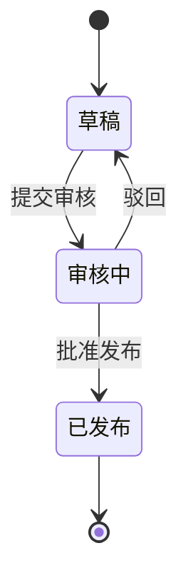

# 微型 PDM 项目规格书

## 1. 业务背景

某制造企业希望用 Frappe 快速搭建一个轻量级 PDM（产品数据管理）系统，用于管理物料、BOM（物料清单）和 ECO（工程变更单）。系统的目标不是替代完整 PLM，而是验证 Frappe 在业务建模、审批流、跨单据联动、报表和 API 集成上的完整能力。

## 1.1 从纸面业务到系统对象

在很多制造企业里，工程部门最早可能用 Excel 管理这些资料：

- 一个 Excel 表记录所有物料。
- 一个 Excel 表记录某个产品由哪些物料组成。
- 一个 Excel 表记录每次工程变更。

这种方式短期简单，但问题很快会出现：

- 不同人维护不同版本，容易冲突。
- 改了 BOM 以后，别人不知道是否已经审批。
- 旧版本和新版本混在一起，不好追溯。
- 生产、采购、质量部门看到的数据可能不一致。

本课程要做的事情，就是把这些 Excel 表背后的业务对象变成 Frappe 中的 DocType，并加上权限、流程、校验和报表。

## 1.2 用户故事

- 作为工程师，我希望能维护物料和 BOM 草稿，以便记录产品结构。
- 作为工程经理，我希望只有经过我审核的 BOM 才能发布，以便控制工程数据质量。
- 作为质量人员，我希望只查看已审核 BOM 和已发布 ECO，以便避免使用未确认数据。
- 作为外部系统，我希望通过 API 读取物料数据，以便和 MES、WMS 或采购系统集成。

## 2. 角色定义

- **Engineering User（工程师）：** 维护物料和 BOM 草稿，发起 ECO。
- **Engineering Manager（工程经理）：** 审核 BOM，提交 ECO，发布工程变更。
- **Quality User（质量人员）：** 查看已审核 BOM 和已发布 ECO，不参与提交。
- **System Manager（系统管理员）：** 管理角色、权限、字段、工作流和系统配置。

## 3. 核心业务规则

- 一个 BOM 只能对应一个成品物料。
- BOM 明细中不允许出现重复子项物料。
- BOM 明细数量必须大于 0。
- 已审核 BOM 不允许普通工程师直接修改。
- ECO 发布后不可再编辑。
- ECO 发布时，系统自动将关联 BOM 的版本号更新为 ECO 的目标版本。
- 任何绕过标准 UI 的后台代码，都必须显式考虑权限与审计。

## 4. 数据字典

### P-Item（物料）

| 字段 | 类型 | 必填 | 说明 |
| --- | --- | --- | --- |
| item_code | Data | 是 | 物料编号，建议唯一 |
| item_name | Data | 是 | 物料名称 |
| specification | Small Text | 否 | 规格型号 |

### P-BOM（物料清单）

| 字段 | 类型 | 必填 | 说明 |
| --- | --- | --- | --- |
| bom_code | Data | 是 | BOM 编号 |
| item | Link / P-Item | 是 | 成品物料 |
| version | Data | 是 | 当前版本，如 A.0、A.1 |
| status | Select | 是 | 草稿、已审核 |
| total_qty | Float | 否 | 明细数量合计，由脚本计算 |
| items | Table / P-BOM Item | 是 | BOM 子项 |

### P-BOM Item（BOM 明细）

| 字段 | 类型 | 必填 | 说明 |
| --- | --- | --- | --- |
| item | Link / P-Item | 是 | 子项物料 |
| qty | Float | 是 | 用量，必须大于 0 |
| specification | Small Text | 否 | 从物料主数据带出 |

### P-ECO（工程变更单）

| 字段 | 类型 | 必填 | 说明 |
| --- | --- | --- | --- |
| eco_code | Data | 是 | 变更编号 |
| bom | Link / P-BOM | 是 | 被变更的 BOM |
| reason | Small Text | 是 | 变更原因 |
| target_version | Data | 是 | 发布后的 BOM 版本 |
| effective_date | Date | 是 | 生效日期 |
| approval_status | Select | 是 | 草稿、审核中、已发布 |

## 5. 权限矩阵

| DocType | Engineering User | Engineering Manager | Quality User |
| --- | --- | --- | --- |
| P-Item | 读、写 | 读、写、提交 | 读 |
| P-BOM | 读、写 | 读、写、提交、取消 | 读 |
| P-ECO | 读、写 | 读、写、提交、取消 | 读 |

## 6. ECO 流程

## 7. 最终验收范围

- 可以录入物料、BOM 和 ECO。
- BOM 校验能阻止重复子项和非正数数量。
- 权限能区分普通工程师、工程经理和质量人员。
- ECO 发布后自动更新关联 BOM 的版本与状态。
- 报表能查询已审核 BOM 的物料构成，并支持筛选。
- REST API 能通过 Token 认证读取和创建物料。
- 关键配置可进入 Custom App，并能通过 fixtures 迁移。
