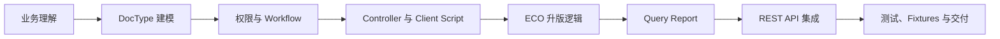

# Frappe ERP 开发教程：基础友好教程

> 仓库主页：[../../README.md](../../README.md)
>
> 许可说明：文档部分采用 CC BY-SA 4.0；`CODE_SNIPPETS.md` 中的代码片段采用 MIT 协议。

本教程面向基础相对薄弱、但希望系统学习 Frappe/ERP 开发的学员。它不会假设你已经熟悉企业系统、低代码平台或复杂架构术语，而是从“什么是表单、什么是单据、什么是主子表”开始，逐步带你完成一个微型 PDM（产品数据管理）系统。

本教程采用循序渐进的讲解方式，适合初学者、转岗开发者和业务顾问。课程会尽量把概念讲具体，把操作步骤拆清楚，并通过贯穿式业务例子帮助读者建立完整理解。

## 📁 课程结构

所有课程文件都位于同一目录，以下链接统一使用 `./文件名.md` 的相对路径，便于在 GitHub、GitLab、Gitea、VS Code 和 Obsidian 等工具中直接跳转。

1. **[讲义部分：核心理念与架构解析 (LECTURE_NOTES.md)](./LECTURE_NOTES.md)**
   - 用生活化例子解释 Frappe、DocType、Workflow、Report、API。
   - 每个核心概念都配一个 ERP/PDM 场景。
   - 先讲“是什么”和“为什么”，再讲“怎么做”。

2. **[基础导学：术语与学习路线 (BEGINNER_GUIDE.md)](./BEGINNER_GUIDE.md)**
   - 解释初学者最容易混淆的概念。
   - 给出课前补课清单和推荐学习顺序。
   - 帮助学员在进入实训前先把语言对齐。

3. **[项目规格：微型 PDM 业务说明 (PROJECT_SPEC.md)](./PROJECT_SPEC.md)**
   - 说明业务背景、角色、权限矩阵、数据字典与验收范围。
   - 帮助学员先理解业务，再进入框架实现。

4. **[实训部分：PDM 系统实战实验 (PRACTICAL_LABS.md)](./PRACTICAL_LABS.md)**
   - 通过 7 个循序渐进的实验，从零构建一个微型 PDM 系统。
   - 每个实验都补充操作入口、示例数据、检查方式和常见错误。

5. **[参考代码：关键实现片段 (CODE_SNIPPETS.md)](./CODE_SNIPPETS.md)**
   - 提供 Controller、Client Script、Query Report、API 调用与测试样例。
   - 建议课堂上先独立实现，再对照参考代码复盘。

6. **[反模式清单：工程化避坑 (ANTI_PATTERNS.md)](./ANTI_PATTERNS.md)**
   - 总结 Frappe/ERPNext 二开中最常见的风险做法。
   - 帮助学员建立可升级、可协作、可审计的开发习惯。

7. **[讲师手册：授课节奏与故障预案 (TEACHER_GUIDE.md)](./TEACHER_GUIDE.md)**
   - 面向讲师，提供课时安排、演示重点、常见故障与课堂提问。

8. **[最终交付清单：项目验收标准 (FINAL_DELIVERY_CHECKLIST.md)](./FINAL_DELIVERY_CHECKLIST.md)**
   - 用于结课演示、作业评分和团队内部验收。

## 🎓 适用对象与前置知识

- **核心对象：** 初级开发者、ERP 实施顾问、业务分析师、传统系统维护人员、准备转向 Frappe/ERPNext 的团队成员。
- **前置要求：**
  - **Python：** 看得懂变量、函数、类和 `if/for`，不要求熟练掌握框架。
  - **JavaScript：** 知道什么是事件、函数和对象即可。
  - **SQL：** 理解“表、字段、行、查询”的基本概念。
  - **Linux/CLI：** 会复制命令到终端执行，知道当前目录是什么意思。

## 🧭 建议学习顺序

1. 先读 [BEGINNER_GUIDE.md](./BEGINNER_GUIDE.md)，弄清 DocType、Document、Field、Link、Table、Workflow 等词。
2. 再读 [PROJECT_SPEC.md](./PROJECT_SPEC.md)，先理解要做的业务系统长什么样。
3. 然后读 [LECTURE_NOTES.md](./LECTURE_NOTES.md)，把概念和业务例子连起来。
4. 最后按 [PRACTICAL_LABS.md](./PRACTICAL_LABS.md) 做实验。
5. 遇到代码卡住时，再查 [CODE_SNIPPETS.md](./CODE_SNIPPETS.md)。

## 🛠️ 环境说明

- **框架版本：** Frappe Framework v15 / ERPNext v15 (可选)。
- **数据库：** 核心推荐 MariaDB (PostgreSQL 支持目前仍有局限)。
- **工具链：** Frappe Bench, Docker (推荐用于本地快速搭建), VS Code。

## 🗺️ 课程地图

## 🚦 课前环境检查

在开始实验之前，请确保你的开发环境已准备就绪：

1. **Bench 版本：** 运行 `bench --version`，确保输出版本为 5.x 或更高。
2. **Frappe 版本：** 在站点目录下运行 `bench version`，确认 `frappe` 和 `erpnext` (可选) 为 `v15.x.x`。
3. **站点就绪：** 确保已通过 `bench new-site test.localhost` 创建站点，并能通过浏览器访问 `http://test.localhost:8000`。
4. **管理员权限：** 确保拥有 `Administrator` 账号及密码。
5. **App 准备：** 确保已通过 `bench new-app pdm_tutorial` 创建了专属的 Custom App，并安装到站点。

## 🪜 初学者学习节奏

- 第一次学习时，不要急着理解所有底层机制，先让系统跑起来。
- 每做完一个 DocType，就马上到 UI 中新建一条数据，确认自己真的理解字段含义。
- 每次写代码前，先用一句话说清楚业务规则，例如“BOM 明细不能重复物料”。
- 每次出现报错，不要只看最后一行，先看报错类型，再看哪个 DocType 或字段名出错。
- 如果你是业务顾问，可以先不写测试，但必须能解释每个字段和流程为什么存在。

## 🧮 评分 Rubric

最终项目按 100 分评估：

- DocType 建模与字段设计：20 分
- 权限矩阵与 Workflow：15 分
- 后端业务逻辑：20 分
- 前端联动体验：10 分
- Query Report 与数据导出：10 分
- REST API 集成：10 分
- Fixtures、迁移与代码组织：10 分
- 测试与结课演示：5 分

## 🧭 路线图

欢迎大家一起补充和参与。如果你发现缺少的主题、不够清楚的解释、更好的示例或有价值的教学材料，欢迎提交 issue 或 pull request。

- [ ] 补充截图
- [ ] 增加可运行的 Frappe 示例 App
- [ ] 增加基于 Docker 的环境搭建指南
- [ ] 发布 GitHub Pages 文档站
- [ ] 增加视频讲解
- [ ] 增加高级架构模块

---
*祝你在 Frappe 的世界中，重新定义你的开发效率与业务价值。*
