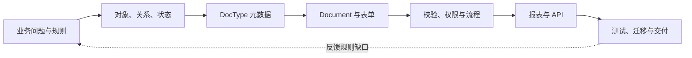

# Frappe 系统教材：从业务模型到可交付应用

> 适用范围：以 Frappe Framework v15 为学习基线，以微型 PDM 为贯穿案例。本文是从上到下的学习教材，不是 ERPNext 全模块手册，也不是可以直接安装的示例 App。各段代码说明一种机制，落地时须按自己的业务规则、App 路径与权限配置调整。

## 开始之前：先理解 ERP、ERPNext 与 Frappe

### ERP 是什么

ERP 是 Enterprise Resource Planning（企业资源计划）的缩写。它不是一张“大而全”的表，而是让销售、采购、库存、生产、财务等环节围绕约定的业务对象和规则协同工作的一类系统。一个订单可能引出采购或生产需求，物料的收发又影响库存与成本；如果各部门只维护自己的表格，同一个编号、数量或状态很容易出现不同说法。

ERP 建设因此不只是把纸质单据搬进电脑。首先要回答：哪些对象需要统一定义？数据由谁负责？一个动作何时发生、由谁批准？哪些例外允许发生？系统随后才有条件把这些约定连接为可执行、可查询、可追溯的流程。本教材用物料、BOM 和 ECO 展示其中一小段，不要求先掌握整套企业管理理论。

### ERPNext 和 Frappe 从哪里来，它们是什么关系

从要解决的问题来理解两者：企业需要把分散的业务记录和流程放到同一套可用的系统里；**ERPNext** 是面向这一需求的开源 ERP 应用，提供会计、采购、销售、库存、制造等业务功能；**Frappe Framework** 是支撑 ERPNext 的通用 Web 应用框架，提供 DocType 元数据、表单、权限、报表和 API 等基础能力。Frappe 不等于 ERPNext，也不只服务于 ERP；可以使用 Frappe 构建自己的业务应用。本教材的微型 PDM 就是在框架层学习建模，而不是从头实现一个完整 ERPNext。

| 名称 | 可以怎样理解 | 本教材关注什么 |
| --- | --- | --- |
| ERP | 企业业务协同与资源计划的系统类别及建设问题 | 先厘清对象、规则与责任 |
| ERPNext | 基于 Frappe 的具体开源 ERP 产品 | 借鉴业务场景，不逐一学习其所有模块 |
| Frappe Framework | 可构建 ERPNext 及其他数据驱动应用的通用框架 | 学习元数据、单据、扩展、权限与交付机制 |

这里的“由来”是帮助学习的**问题与产品关系**，不是精确的项目编年史。关于产品定位与技术关系，可查阅 [ERPNext 官方介绍](https://docs.frappe.io/erpnext/user/manual/en/introduction)和 [Frappe Framework 官方介绍](https://docs.frappe.io/framework/v15/user/en/introduction)。

### ERP 建设能提升什么，不能替代什么

如果物料定义、审批责任和数据口径已经清楚，ERP 可以减少重复录入、跨部门对账与人工追问，让信息传递和执行更有效率，也使过程更容易检查。但**管理效率**不等于**管理水平**：后者涉及目标是否合理、职责是否清晰、规则是否公平且可执行、异常如何裁决，以及管理者是否根据结果调整决策。系统可以暴露和约束问题，不能凭上线这一动作从根本上解决它们。

例如，两个部门对“供应商换型号是否要新建物料”意见相反。直接在系统里加一个字段或强制流程，可能让不一致的做法更快、更稳定地传播；应先讨论并确认业务判断与例外处理，再用 Frappe 实现。若 ERP 项目确实推动了管理改进，关键也在于这场业务梳理和后续治理，而不是软件自动赋予组织更高的管理水平。

**带着这个判断继续学习：** 当前问题是“规则已明确，但执行低效”，还是“规则本身尚未明确”？前者适合优先考虑系统化，后者要先回到业务模型。

## 读完之后，你应当能做什么

1. 画出业务规则、DocType 元数据、Document、表单、后端逻辑和交付配置的关系。
2. 面对一个需求，先判断是业务模型尚未说清、标准元数据可以表达，还是确实需要自定义代码。
3. 用物料、BOM、ECO 解释主数据、主子表、校验、权限、工作流、报表和 API 各自的职责。
4. 从一个最小表单逐层扩展，设计正反例、测试和跨环境交付检查。

**前置知识：** Python 条件、循环和类；JavaScript 事件；SQL 表、行、关联；HTTP 请求。术语不熟时先看[基础导学](./BEGINNER_GUIDE.md)。动手需要已有可访问的 Frappe v15 开发站点，以及用于练习的 App；环境核对见[课程入口](./README.md#-课前环境检查)。没有环境也可以先完成本教材的建模题。

## 第一层：先看全局地图

核心路径不是“学完所有 API”，而是完成一次从业务问题到可验证交付的闭环：



| 层次 | 要回答的问题 | 典型产物 | 暂时不要做的事 |
| --- | --- | --- | --- |
| 业务 | 什么是物料、什么情况算升版、谁负责批准？ | 业务术语、正常与例外案例、验收规则 | 把各方分歧当成程序错误 |
| 模型 | 哪些对象独立存在，哪些只是单据明细？ | 对象关系、字段字典、状态图 | 先按页面数量设计数据库表 |
| 平台 | 哪些行为由元数据和标准能力提供？ | DocType、Link、Table、角色 | 为每种单据重写 CRUD |
| 扩展 | 哪些规则需要可靠的服务器校验？ | Controller、表单脚本、流程 | 用浏览器提示代替后端校验 |
| 交付 | 如何让结果可查询、可集成、可验证？ | 报表、API、测试、配置迁移 | 只证明管理员在本机能点通 |

**选学分支：** 网站门户、复杂性能优化、异步任务、多站点运维和 ERPNext 业务模块不属于这条入门主线。完成主线后，再按项目需要查官方文档深入。

## 第二层：理解 Frappe 的核心机制

### 1. 先认清代码和数据放在哪里

| 名词 | 在系统中的角色 | 用本课程理解 |
| --- | --- | --- |
| Bench | 管理开发环境、应用、站点及常用命令的工作区 | 在 Bench 内运行开发服务、迁移与测试 |
| App | 可安装到站点的代码包 | `pdm_tutorial` 放课程自定义代码与可随代码交付的定义 |
| Site | 一套站点配置与业务数据的运行边界 | 练习站点保存你创建的物料、用户及配置 |
| Module | App 内组织相关功能的逻辑分类 | 把 PDM 相关 DocType 放到对应模块 |
| DocType / Document | 类型定义 / 该类型的一条业务记录 | `P-Item` / `item_code` 为 `MAT-SCREW-001` 的物料记录 |

先有 Bench、Site 和已安装的 App，才能在课程中实践自定义 DocType。**不要混淆 App 代码与站点数据：** 在某站点手工配置成功，不表示换一站点安装同一 App 就自然得到所有角色、流程及示例记录；交付时要分别检查代码、配置迁移与测试数据。具体建站和 App 操作以[课前环境检查](./README.md#-课前环境检查)及对应版本的官方教程为准。

### 2. 为什么先定义元数据，而不是先写 CRUD

传统 CRUD 的合理目标是让每个业务对象可以增删改查。若每个对象都手写表、接口、表单、列表和基础权限，相似工作会随着对象数量重复。Frappe 的切入点是先描述 **DocType**：它有哪些字段、字段类型、命名方式、关联和权限；框架据此提供大量通用的存储与交互能力。CRUD 没有消失，而是由通用机制承担基础部分。

以 `P-Item` 为例，定义 `item_code` 和 `item_name` 后，学员先观察表单、列表与记录如何出现；只有“编号怎样判重”“什么人能改”等问题，才进入更具体的配置和规则。**取舍：** 元数据可以描述已确定的结构，却不能替企业决定“供应商型号变了是否还是同一种物料”。

### 3. 一条记录从页面到数据库经历什么

```text
业务方确认规则
  → 开发者定义 DocType（类型）
  → 用户在表单中创建 Document（某一条记录）
  → 保存时检查字段、权限和服务器端业务校验
  → 数据持久化，再由列表、报表或 API 读取
```

`DocType` 是类型，`Document` 是实例；`P-BOM` 是一类单据，某张编号为 `BOM-FG-MOTOR-001-A0` 的 BOM 是一条 Document。`Link` 引用另一个独立对象，`Table` 容纳隶属于当前单据的多行子记录。Controller 的 `validate` 参与保存校验；浏览器里的 Client Script 负责即时交互，不能覆盖 API 等非表单入口。[Document API](https://docs.frappe.io/framework/v15/user/en/api/document) 和 [Controller 文档](https://docs.frappe.io/framework/v15/user/en/basics/doctypes/controllers)可用于查阅具体方法与事件。

### 4. 平台与业务各负责什么

ERP 把复杂业务中的对象、数据和约定流程数字化，能够减少重复操作、提高查询和协作效率，也可能暴露旧流程的矛盾；它**不会因上线而自动提升管理水平**。业务负责人决定概念、例外、责任与取舍；开发者把已确认的规则放到合适的元数据、流程或代码中；Frappe 提供执行这些设计的基础能力。

遇到“系统无法处理升版”时，先追问：旧版是否保留？同一个物料是否允许多个有效 BOM？例外由谁批准？这些答案互相冲突，增加字段或换技术框架都不能代替业务决策。

## 第三层：用一个最小实例建立手感

先只做 `P-Item`，不同时引入审批、报表和脚本。已有开发站点和 App 的学员按下表操作；没有环境的学员先写出字段及理由。

| 步骤 | 操作 | 应观察到什么 |
| --- | --- | --- |
| 1 | 与业务方确认“物料编号标识什么”，写出两条物料样例 | 同一编号是否代表同一物料有一致答案 |
| 2 | 在开发 App 对应模块中创建 `P-Item` DocType | 系统识别一种新单据类型 |
| 3 | 加 `item_code`（Data，必填）、`item_name`（Data，必填）、`specification`（Small Text，可选） | 表单随字段定义变化 |
| 4 | 在 UI 创建 `MAT-SCREW-001`、`螺丝`、`M6` 的记录 | 列表出现记录，打开后字段仍在 |
| 5 | 清空必填字段并尝试保存；再使用第二个用户检查读取或创建权限 | 分辨字段约束和角色权限不是同一件事 |

这里刻意不指定企业的编码系列、唯一性和版本策略：这些先由业务定义，再配置与验证。**本实例的最小闭环**是“规则说明 → DocType → 表单 → 保存 → 列表 → 一条失败案例”。成功创建记录还不能证明权限或交付正确。

回看地图：步骤 1 是业务层；2–3 是元数据层；4 是 Document 与表单；5 是校验和权限。现在再读[项目规格](./PROJECT_SPEC.md)，你会知道接下来为什么需要 BOM 和 ECO。

## 第四层：逐层扩展 PDM 案例

### 1. 从物料扩展到 BOM：关系与校验

**目的：** 表达“一个成品由多种子项组成”，而不是为每一行 BOM 明细建一个独立业务页面。`P-BOM` 的 `item` 用 Link 引用成品物料；`items` 用 Table 容纳 `P-BOM Item`；子表行再用 Link 引用子项物料，`qty` 表示用量。保存时拒绝重复子项和非正数数量。

| 概念 | 基本形式 | 在案例中的例子 | 常见误区 |
| --- | --- | --- | --- |
| Link | 字段指向另一 DocType | BOM 表头选择成品 `P-Item` | 把成品名称复制为自由文本 |
| Table | 字段包含子 DocType 多行 | 一张 BOM 包含多行 `P-BOM Item` | 把子表当独立审批单据 |
| Controller | Document 生命周期内的后端逻辑 | `validate` 拒绝重复子项 | 只在表单脚本里提示错误 |
| Client Script | 浏览器表单事件与即时反馈 | 修改数量后更新显示值 | 以为 API 写入也会执行浏览器脚本 |

可先用纸笔预测：同一 BOM 中 `MAT-SCREW-001` 出现两次、数量分别为 2 和 3，保存应成功还是失败？**参考判断：** 按本课程规则应失败；不能以“总数等于 5”为由忽略重复。实现机制见[参考代码](./CODE_SNIPPETS.md)，动手顺序见[实验一、二](./PRACTICAL_LABS.md)。

### 2. 从校验扩展到审批：权限与状态

**目的：** 让工程师维护草稿，工程经理审批，质量人员按已确认的可见范围查看结果。角色权限回答“谁可创建、读、写、提交”；Workflow 回答“单据能从哪个状态转到哪个状态、由谁触发”。二者相关，但不是同一个设置。先画状态图、定义动作及负责人，再配置系统。

```
草稿 --提交审核--> 审核中 --批准发布--> 已发布
                       └--驳回--> 草稿
```

可提交单据还涉及 `docstatus`（草稿、已提交、已取消）；业务状态名和单据提交状态应分别写明，不能仅凭界面显示“已发布”推断所有发布动作已经执行。**检验方式：** 用工程师和经理账号分别尝试同一动作，并用不应看到草稿的账号检查列表、直接打开和 API。权限设计以已确认的业务范围为准。[角色与权限](https://docs.frappe.io/framework/v15/user/en/basics/users-and-permissions)提供机制参考。

### 3. 从审批扩展到变更：ECO 与业务模型

**目的：** 把“为什么改、改哪张 BOM、目标版本是什么、谁批准”放进 `P-ECO`。是否复制新版 BOM、是否允许覆盖、旧版保留多久，属于**待确认的业务策略**，不要从一段 `on_submit` 示例反推生产制度。批准动作确定后，再决定使用生命周期事件、服务函数或其他受控处理。

尝试写两条业务案例：正常升版 `A.0 → A.1`；审批后发现目标版本写错。若团队无法一致回答如何处理第二条案例，应暂停实现并补业务规则。Frappe 能执行规则，不负责替团队选择规则。

### 4. 从业务数据扩展到报表与 API

报表给人回答问题，例如“已审核 BOM 有哪些子项、各用多少”；API 给其他系统受控地读取或创建记录。Query Report 可用 SQL 关联 BOM 表头与明细，并配置成品物料过滤器；但 SQL 写出的结果范围仍需按业务可见性设计、用不同用户验证，不要把报表访问权限直接等同于每一行数据都可以公开。[Query Report](https://docs.frappe.io/framework/v15/user/en/desk/reports/query-report)说明其查询与过滤机制。

Frappe 的资源 API 可以访问 DocType，Token 代表某个用户身份，权限仍需按该用户验证。测试时分别检查有效身份且有权、有效身份但无权、无效凭据；切勿把真实密钥写进文档或版本库。最小路径是 `GET /api/resource/P-Item`，然后才考虑写入和集成错误处理。[REST API](https://docs.frappe.io/framework/v15/user/en/api/rest)给出请求与认证格式。

### 5. 从“能演示”扩展到“能交付”

至少准备：一条正常保存、一条重复子项失败、两种角色的权限差异、一条 ECO 变更、一次报表筛选和一次 API 访问。再把核心规则写成测试，核对 App 中的 DocType 与需要迁移的配置，换一个环境验证。fixtures 用于将指定数据库记录导出并随 App 同步，不能仅凭本地数据库里看得到配置就认为已交付。[测试](https://docs.frappe.io/framework/v15/user/en/guides/automated-testing/unit-testing)与 [Hooks / fixtures](https://docs.frappe.io/framework/v15/user/en/python-api/hooks)是继续查阅的入口；课程的人工验收见[最终交付清单](./FINAL_DELIVERY_CHECKLIST.md)。

## 第五层：练习、反馈与迁移

先不看答案，写下预测、理由和验证方式；有开发环境时再用实验验证。

1. **分类题：** “增加规格字段”“定义同型号不同供应商是否为同一物料”“禁止 BOM 重复子项”分别属于元数据配置、业务决策还是业务规则实现？
2. **画图题：** 画出 `P-Item`、`P-BOM`、`P-BOM Item`、`P-ECO` 的关系，并说明三个 Link 和一个 Table 各自承担什么。
3. **预测题：** 页面计算的总量正确，但通过 API 提交了重复 BOM 子项。仅有 Client Script 时会怎样？应把最终校验放在哪里？
4. **权限题：** 一个用户能打开 Query Report，能否据此断定报表每行都符合他的记录级可见范围？设计一个负向测试。
5. **迁移题：** 在开发站点能完成审批，在新站点没有相同角色或工作流。你先核对哪些资产和步骤？
6. **反思题：** 一个部门要求“上线后自然消除所有审批扯皮”。这个目标为什么不能直接转成开发任务？应该先得到什么业务结论？

**参考解题要点：**

- 1：规格字段可由元数据描述；“同一物料”的判定先由业务决定；重复子项是明确规则后由服务器可靠执行的校验。
- 2：BOM 表头 Link 到成品，明细行 Link 到子项；表头的 Table 包含多行明细；ECO Link 到需要变更的 BOM。
- 3：浏览器脚本不会替 API 完成校验；在 Document 的后端校验中保护保存路径，并用失败案例测试。
- 4：不能；用具有报表入口权限但不应读取某条草稿的账号检查实际结果，再核对查询与记录级可见规则。
- 5：核对 App、DocType、角色/权限、Workflow、fixtures、迁移和测试账号；在干净站点重新验收，而不是只刷新浏览器。
- 6：系统只能执行已达成一致的审批责任和例外处理；先约定谁批准、何时批准、冲突由谁裁决以及如何验收。

## 边界、常见误区与下一步

| 看到的现象 | 不要立刻认定 | 先检查 |
| --- | --- | --- |
| 表单字段不合用 | “Frappe 字段太少” | 业务对象和字段含义是否已经统一 |
| 页面校验正常、接口数据异常 | “API 有 bug” | 规则是否只写在 Client Script 中 |
| 工作流走不通 | “多加一个状态就好” | 动作、角色、状态及业务例外是否一致 |
| 报表和单据列表结果不同 | “某个页面坏了” | 查询条件、用户权限和数据口径是否一致 |
| 本地能演示、新站点不能 | “重启服务即可” | App、配置导出、迁移和测试是否完整 |

现在把全图再说一遍：**业务先定含义与边界 → DocType 元数据表达对象 → Document 承载记录 → 后端校验、权限和流程约束行为 → 报表/API 提供使用入口 → 测试与迁移检验能否交付。** 不要把框架特性当成业务模型，也不要把数字化当成管理决策的替身。

下一步按[七个实验的能力地图](./README.md#七个实验的能力地图)完成主线；遇到术语查[基础导学](./BEGINNER_GUIDE.md)，想看完整操作查[实训](./PRACTICAL_LABS.md)，排查工程习惯查[反模式清单](./ANTI_PATTERNS.md)。官方文档会随版本演进，命令和行为以你实际使用的 Frappe 版本为准。
